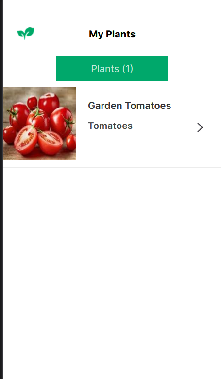
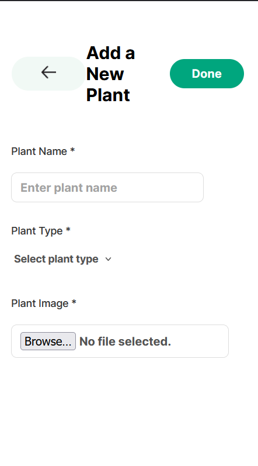
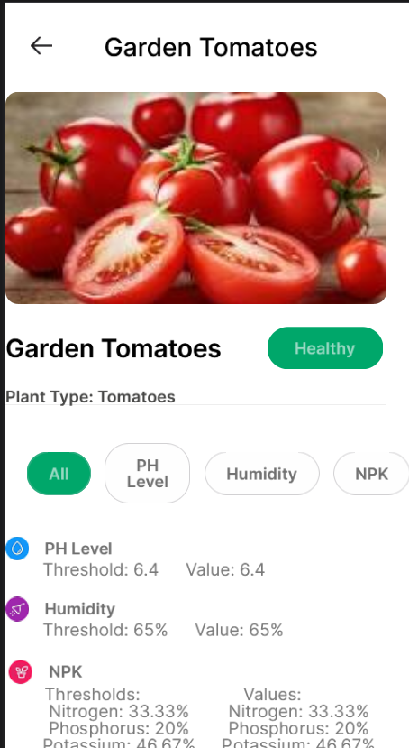

# Agrinova: Smart Plant Management

Agrinova is a web app designed for managing indoor plants. It helps users track their plants, manage watering schedules, and get real-time notifications, ensuring that their plants stay healthy and well-maintained.

## Features

- **Plant Tracking**: Add and manage your plants with specific details.
- **Watering Schedules**: Set up reminders for when to water your plants.
- **Real-time Notifications**: Get alerts for upcoming plant care tasks.
- **User Authentication**: Secure login and registration using Firebase Authentication.

## Technologies Used

- **Frontend**: React.js
- **Backend**: Firebase Realtime Database
- **Authentication**: Firebase Authentication

## Live Demo

Visit the live demo at: [Agrinova Demo](https://agrinova01.netlify.app/)

## Installation

To run this project locally, follow these steps:

1. Clone the repository:

   ```bash
   git clone https://github.com/ahmadkhatib02/agrinova.git
   ```

2. Navigate into the project directory:

   ```bash
   cd smart-irrigation-system
   ```

3. Install the required dependencies:

   ```bash
   npm install
   ```

4. Start the development server:
   ```bash
   npm run dev
   ```

Make sure you have a Firebase project set up and the necessary configuration files in place.

## Screenshots

### Plant Dashboard



### Add New Plant



### About Plant



### Account Page


## Contributing

Feel free to fork the repository and submit pull requests. Any contributions are welcome!

## License

This project is licensed under the MIT License - see the [LICENSE](LICENSE) file for details.
