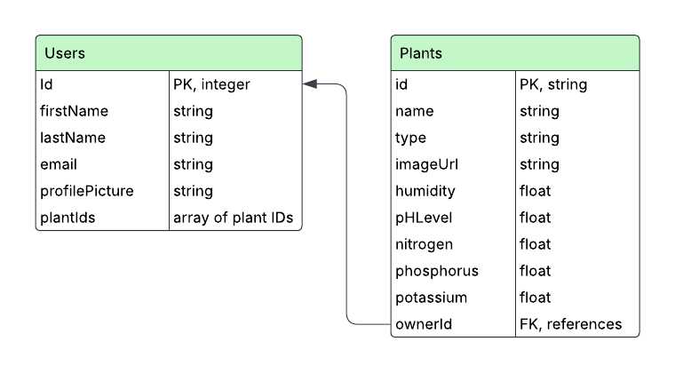

# Home Page Component Documentation  

## Overview  
The **Home Page** component displays a list of the user's plants fetched from the Firebase Realtime Database. It dynamically shows plant data, allows navigation to add new plants, and includes a header and footer for consistent layout.  

## Component Features  
- Fetches plant data from the database using the provided `userID`.  
- Displays all plants belonging to the user.  
- Shows a conditional message if no plants are available.  
- Displays the total number of plants in the header.  
- Includes an add button to navigate to the add-plant page.  

## Key Functionalities  

### Data Fetching  
- Uses `useEffect` and Firebase’s `onValue` listener to fetch plants under the user's `plants` node.  
- Data is stored in a state variable `plant` as an array.  

### Conditional Rendering  
- If the user has plants, it displays them using the `DisplayPlant` component.  
- If the user has no plants, it displays a message via `DisplayNone`.  

### Navigation  
- The `+` button navigates the user to the Add Plant page using `useNavigate` from `react-router-dom`.  

## Props  
- **userID**: The ID of the currently logged-in user, used to fetch plant data.  

## Imported Components  
- `Header` — Displays the header and plant count.  
- `Footer` — Displays the page footer.  
- `DisplayPlant` — Renders a list of plants.  
- `DisplayNone` — Shown when the user has no plants.  

## Styling  
- Styling for the add button is managed in `AddButton.css`.  

---

# Add Plant Page Component Documentation  

## Overview  
The **Add Plant Page** allows users to add a new plant to their profile by submitting its name, type, and image. Once added, the plant is stored in the Firebase Realtime Database under the user's plant list.  

## Component Features  
- Form-based plant creation with validation for required fields.  
- Dynamically determines the plant's `id` based on the current plant count.  
- Sets default plant metrics (humidity, pH level, and nutrients).  
- Image upload uses a local path reference for frontend development purposes.  
- Navigates back to the home page after successful submission or via a back button.  

## Key Functionalities  

### Form Handling  
- The form requires three fields:  
  - **Plant Name**  
  - **Plant Type** (dropdown selection)  
  - **Plant Image** (local file)  

- On submit, the form data is pushed into Firebase under `users/{userID}/plants`.  

### Plant Object Structure  
Each plant entry added has the following structure:  
- **id**: Incremented based on the current number of plants.  
- **name**: Plant name input by the user.  
- **type**: Plant type selected by the user.  
- **imageUrl**: Local development image path (e.g., `./src/images/filename.png`).  
- **metrics** (default values):  
  - humidity: 50 (float)  
  - pHLevel: 7.0 (float)  
  - nutrients:  
    - nitrogen: 20.0 (float)  
    - phosphorus: 10.0 (float)  
    - potassium: 15.0 (float)  

### Navigation  
- Clicking the **Done** button submits the form and redirects to `/homePage`.  
- Clicking the **Cancel** button (with the back arrow) navigates back to `/homePage` without submission.  

## Props  
- **userID**: The current user's ID, used to determine where in the database to push the new plant.  

## Imported Components  
- `Footer` — Displays the page footer.  

## Styling  
- Styles are managed in `AddPlantPage.css`.

# Plant Types Data Module Documentation

## Overview

The Plant Types Data Module provides a predefined list of plant types along with their optimal environmental metrics for use in the smart irrigation system. This dataset can be used to compare actual soil conditions against ideal conditions to make decisions about irrigation or plant recommendations.

## Module Features

Exports a static array of plant types and their optimal growing conditions.
Each plant includes metrics for humidity, pH level, and essential nutrients (NPK).
Can be used to determine the best plant for given soil conditions or to set default metric templates.
Data Structure

## Each plant object contains the following properties:

- type: Name of the plant.
- humidity: Recommended soil humidity in percentage.
- pHLevel: Ideal soil pH level.
- nitrogen: Ideal nitrogen percentage.
- phosphorus: Ideal phosphorus percentage.
- potassium: Ideal potassium percentage.

## Included Plant Types

- Potatoes
- Tomatoes
- Wheat (Spring)
- Wheat (Winter)
- Onion (Green)
- Onion (Dry)
- Onion (Seed)

---

# About Plant Page Component Documentation

## Overview

The About Plant Page displays detailed information about a selected plant, including its current metrics and how they compare to the ideal growing conditions stored in the Firebase Realtime Database. It allows users to view all metrics or filter by pH level, humidity, or nutrient (NPK) values. It also determines if the plant is "Healthy" based on threshold comparisons.

## Component Features

- Displays selected plant’s name, type, image, and current condition (Healthy/Unhealthy).
- Fetches ideal metric thresholds from Firebase for the specific plant type.
- Compares current vs. ideal conditions to determine health status.
- Allows switching between tabs (All, pH Level, Humidity, NPK) to view specific data.
- Includes a back button to return to the previous page.

### Key Functionalities

## Data Handling

- Uses useLocation to receive the selected plantObject from the previous page.
- Fetches ideal conditions for the plant type from Firebase on initial render.
- Tracks loading state for both plant data and threshold data.
- Health Check Logic
- Compares plant metrics (pH, humidity, nitrogen, phosphorus, potassium) against ideal values.
- Returns Healthy if all key metrics are within defined acceptable ranges.
- Otherwise, displays Unhealthy.

## Navigation
Back button at the top navigates to the previous page using useNavigate.

## Tab Selection

- Users can switch between four views:
- All: Shows all metrics in one view.
- PH Level: Displays only pH comparison.
- Humidity: Displays only humidity comparison.
- NPK: Displays only nitrogen, phosphorus, and potassium comparison.

## Props

plantObject (from route location.state): The selected plant to be displayed and analyzed.

## Imported Components

- Footer — Displays the page footer.
- All — Displays all metric comparisons.
- Ph — Displays pH level comparison.
- Humidity — Displays humidity comparison.
- NPK — Displays nutrient (NPK) comparison.

## Styling

Styling is managed in AboutPlant.css.

---

# Database Component Documentation  

## Overview  
This database setup contains user profiles and their associated plant data for the smart irrigation system. It is structured to allow storing, uploading, and retrieving user and plant information from Firebase Realtime Database.  

## Database Structure Diagram

## Data Structure  

### Users Collection  
- **id** (integer)  
- **firstName** (string)  
- **lastName** (string)  
- **email** (string)  
- **password** (string)  
- **profilePicture** (string - image path)  
- **plants** (array of plant objects)  

### Plant Object Structure (inside each user)  
- **id** (integer)  
- **name** (string)  
- **type** (string)  
- **imageUrl** (string - image path)  
- **metrics** (object)  
  - **humidity** (float)  
  - **pHLevel** (float)  
  - **nutrients** (object)  
    - **nitrogen** (float)  
    - **phosphorus** (float)  
    - **potassium** (float)  

---

## Server Import Script Overview  
- The server script uses **Firebase Admin SDK** to upload the user and plant data from `db.js` to the Firebase Realtime Database.  
- It initializes Firebase using a service account JSON key and uses environment variables to access the database URL.  
- The script loops through each user and uploads them under the `users/` reference, with the user ID as a key.  
- Once run, all users and their plant data become available in the Firebase console for use by the smart irrigation system app.  
 
---

